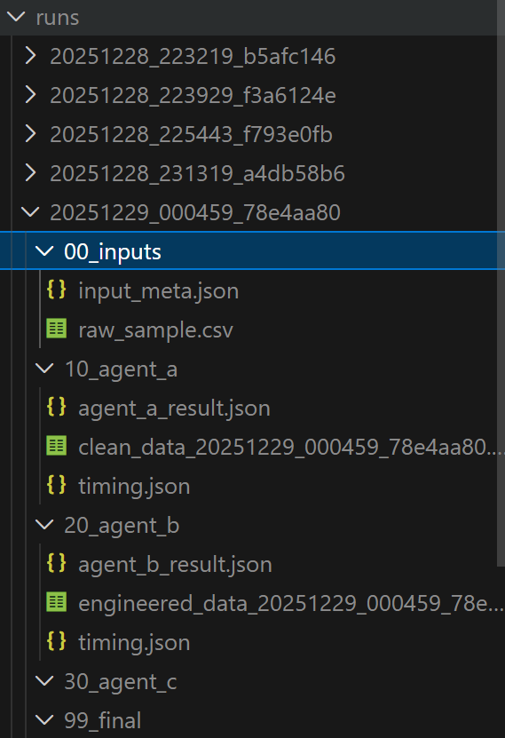
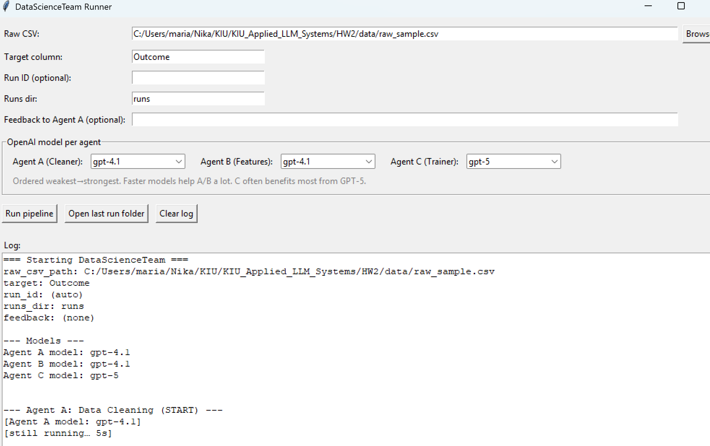

# Applied LLM Systems — HW2: DataScienceTeam (Agents A→B→C)

This project implements a **multi-agent data science pipeline** powered by LLMs and constrained tool interfaces. The system takes a raw CSV dataset and a target column, then runs:

1) **Agent A**: audits + cleans the dataset  
2) **Agent B**: engineers + selects features  
3) **Agent C**: generates + executes Python to train an XGBoost model iteratively

Artifacts (JSON logs, CSV snapshots, generated code, etc.) are saved per run for reproducibility.

---

## Quickstart

### 1) Install dependencies
```bash
pip install -r requirements.txt
````

### 2) Run (recommended): GUI

```bash
python HW2_GUI.py
```

### 3) Run: CLI

```bash
python HW2.py --raw path/to/raw.csv --target Outcome
```

---

## Project Layout

```
.
├─ agents/
│  ├─ data_cleaner_agent.py
│  ├─ feature_engineer_agent.py
│  └─ model_trainer_agent.py
│
├─ tools/
│  ├─ cleaner_tools.py
│  ├─ feature_tools.py
│  └─ model_trainer_tools.py
│
├─ test/
│  └─ (unit tests live here)
│
├─ scripts/
│  └─ (smoke test / demo runs live here)
│
├─ data/
│  ├─ clean_data.csv (or clean_data_<run_id>.csv)
│  └─ engineered_data.csv (or engineered_data_<run_id>.csv)
│
├─ runs/
│  └─ <run_id>/
│     ├─ 00_inputs/
│     ├─ 10_agent_a/
│     ├─ 20_agent_b/
│     ├─ 30_agent_c/
│     └─ 99_final/
│
├─ DataScienceTeam.py   (or DataScienceTeam class in root)
├─ HW2.py               (CLI entrypoint)
├─ HW2_GUI.py           (GUI entrypoint)
└─ requirements.txt
```

---

## Architecture (High Level)

The system is built around a single orchestrator class: **`DataScienceTeam`**, which runs agents in a strict sequence:

**Raw CSV → Agent A → Clean CSV → Agent B → Engineered CSV → Agent C → Model + Metrics**

---

## Agents Overview

### Agent A — Data Cleaner (`agents/data_cleaner_agent.py`)

**Role:** Data auditor/cleaner
**Input:** raw CSV path (+ optional feedback)
**Output:** cleaned CSV path + audit summary + decisions/logs

**What it does:**

* Loads the raw CSV with pandas
* Inspects metadata (shape, nulls, types)
* Uses an LLM loop that proposes tool calls as JSON
* Applies tool calls to clean data
* Saves `clean_data.csv` (or `clean_data_<run_id>.csv`) in the `data/` folder
* Returns a structured handoff for Agent B

**Tools available to Agent A (`tools/cleaner_tools.py`):**

* `inspect_metadata(df)` — dataset overview (shape, missingness, dtypes)
* `get_column_stats(df, col)` — detailed stats for a specific column
* `impute_missing(df, col, strategy)` — mean/median/mode imputation
* `drop_column(df, col)` — remove a column entirely

**Key design choice:**
Agent A is responsible for *mechanical robustness* (JSON parsing tolerance, tool execution errors, etc.) while the LLM makes *semantic cleaning decisions*.

---

### Agent B — Feature Engineer (`agents/feature_engineer_agent.py`)

**Role:** Feature engineering + redundancy removal
**Input:** clean CSV path + Agent A summary + target column
**Output:** engineered CSV path + strategy summary + decisions/logs

**What it does:**

* Loads cleaned CSV
* Provides metadata + head rows to the LLM
* Uses an LLM loop that proposes tool calls as JSON
* Must:

  * Create **at least one interaction feature**
  * Run correlation analysis vs the target
  * Select top features
* Saves `engineered_data.csv` (or `engineered_data_<run_id>.csv`) in the `data/` folder

**Tools available to Agent B (`tools/feature_tools.py`):**

* `create_interaction(df, expression)` — add feature(s) like `"f1 * f2"` or `"Age / Income"`
* `encode_categorical(df, col, method="onehot")` — encode categorical columns
* `correlation_analysis(df, target, top_n=20)` — compute correlation-like ranking vs target
* `select_top_features(df, target, k, keep_cols=None)` — keep only top-k features (+ optional always-keep columns)

**Performance note:**
Agent B can take longer because it may request multiple tool calls and perform correlation/selection repeatedly depending on the LLM plan.

---

### Agent C — Model Trainer (`agents/model_trainer_agent.py`)

**Role:** “Coder” agent that generates and executes training code
**Input:** engineered CSV path + Agent B summary + target column
**Output:** final metrics + final Python code + training logs + decisions/logs

**What it does:**

* Runs an iterative loop:

  1. LLM generates Python code (`code_string`)
  2. Code is executed via `execute_python_code(...)`
  3. Metrics are parsed from `stdout` (must include `METRICS_JSON=...`)
  4. If metrics aren’t good enough, try another configuration
* Stops when:

  * `f1 >= 0.75`, or
  * 3 distinct hyperparameter attempts were made, or
  * max attempts reached

**Tools available to Agent C (`tools/model_trainer_tools.py`):**

* `execute_python_code(code_string)` — runs generated code, captures stdout/stderr/exception

**Important safety/robustness constraints:**

* Generated code must be CPU-laptop friendly (target runtime <= ~30 seconds)
* Must contain a resource/time guard (prints or raises with `RESOURCE_GUARD_TRIGGERED`)
* Must always print `METRICS_JSON={...}` in a `finally` block (include `"error"` on failure)
* Must use a `safe_fit(...)` approach (filters kwargs based on `inspect.signature(model.fit)`)

---

## Orchestrator: `DataScienceTeam`

**File:** root (e.g., `DataScienceTeam.py` or equivalent root module)
**Class:** `DataScienceTeam`

### Responsibilities

* Creates a unique `run_id` (or uses user-provided one)
* Creates run folder structure: `runs/<run_id>/...`
* Calls agents in sequence and validates their outputs:

  * Agent A must return: `clean_data_path`, `audit_summary`
  * Agent B must return: `engineered_data_path`, `strategy_summary`
  * Agent C must return: `final_metrics`, and optionally `final_code`, `training_log`
* Writes all intermediate and final JSON artifacts
* (Optionally) snapshots intermediate CSVs into the run folder

### Run Folder Structure

```
runs/<run_id>/
├─ 00_inputs/
│  ├─ input_meta.json
│  └─ <raw.csv> (optional copied snapshot)
│
├─ 10_agent_a/
│  ├─ agent_a_result.json
│  ├─ timing.json
│  └─ clean_data_<run_id>.csv (optional snapshot)
│
├─ 20_agent_b/
│  ├─ agent_b_result.json
│  ├─ timing.json
│  └─ engineered_data_<run_id>.csv (optional snapshot)
│
├─ 30_agent_c/
│  ├─ agent_c_result.json
│  ├─ timing.json
│  ├─ final_code.py (if provided)
│  └─ training_log.txt (if provided)
│
└─ 99_final/
   └─ final.json
```

**Run folder screenshot:**


---

## CLI vs GUI

### GUI (recommended)

**File:** `HW2_GUI.py`

* Easier workflow: browse for CSV, set target, set feedback, run
* Shows live progress per agent
* Prints **“still running…”** periodically
* Always prints a clear **DONE/FAILED** message and points to the artifacts folder

**GUI screenshot:**


### CLI

**File:** `HW2.py`

* Useful for scripting and automated runs
* Produces the same `runs/<run_id>/...` artifacts layout

---

## Testing

### Unit tests

Tests live in `test/` and are intended to validate orchestration behavior (including fake OpenAI calls / mocks).

```bash
pytest -q
```

### Smoke tests

Smoke / demo runs live in `scripts/` and are intended to exercise the full pipeline end-to-end on sample data.

---

## Outputs Summary

* `data/`

  * `clean_data*.csv` (Agent A output)
  * `engineered_data*.csv` (Agent B output)

* `runs/<run_id>/`

  * full run logs + per-agent results + snapshots + generated model code and logs

---

## Notes

* The **target column** is the label you want the model to predict (e.g., `Outcome`).
* If the target column name is wrong or missing from the CSV, Agent B/C will fail or produce invalid results.
* Agent runtime depends on model choice, dataset size, and number of tool iterations requested by the LLM.
